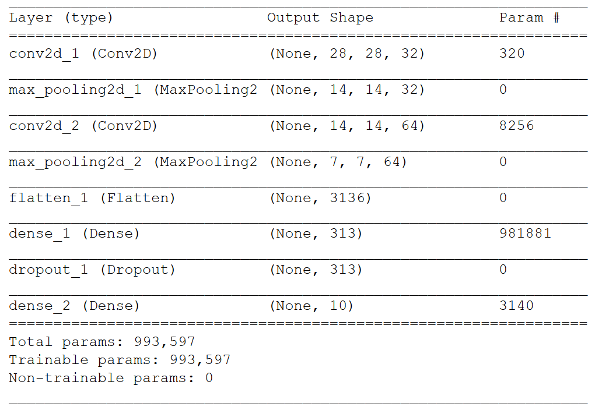
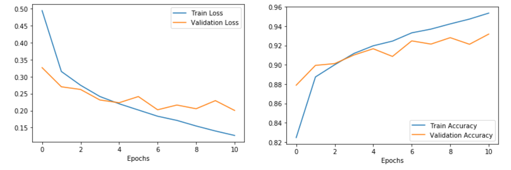
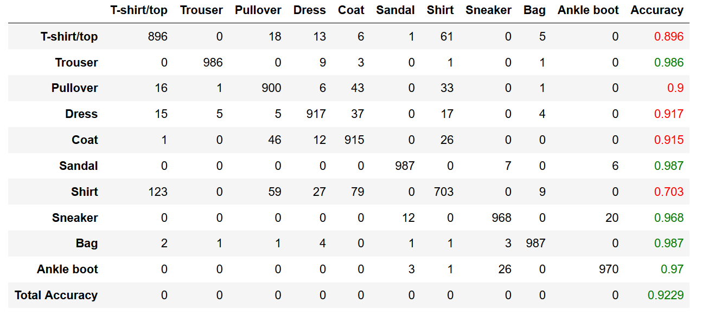

# Image Classification with Keras

This is a Convolutional Neural Networks (CNN) implimentation in Keras, with TensorFlow as backend, to classify images.

## Requirements

Python (3.6.7)

Keras (2.2.4)

Tensorflow (1.11.0)

Numpy (1.16.4)

Scikit Learn (0.21.2)

MatplotLib (3.1.1)

Pandas (0.25.0)

Above requirements are my tested environment. Exact versions may not be necessary for the successful execution of the code.

## Data

Fashion-MNIST data is used in this task. Fashioin-MNIST is released by Zalando as, [original MNIST dataset](http://yann.lecun.com/exdb/mnist/) is too easy and overused.

The train dataset has 60000 samples while the test dataset has 10000 samples. These samples are greyscale images of different apparel, eacch with size 28x28. There are 10 label and are shown in below table.

| Label | Description |
| --- | --- |
| 0 | T-shirt/top |
| 1 | Trouser |
| 2 | Pullover |
| 3 | Dress |
| 4 | Coat |
| 5 | Sandal |
| 6 | Shirt |
| 7 | Sneaker |
| 8 | Bag |
| 9 | Ankle boot |

This data is available directly through Keras library, and will be downloaded as 4 datasets.

For more information regarding data, refer [Zalando Github repo](https://github.com/zalandoresearch/fashion-mnist).

### Pre-processing

Since these are greyscale images, the values range from 0 to 255. The pixels with high values might add unnecessary weight preference in the neural network. So, the pixel data is normalized.

The class label values are in one column ranging from 0 to 9. These labels are one-hot-encoded.

For keras to be able to read the data, it is reshaped to a (28,28,1) from (28,28).

## CNN

This neural network has 2 CNN layers, followed by 2 dense (fully-connected) layers. Each CNN layer also has Maxpooling layers. 2 dropout layers are also included: one after the 2nd CNN layer and the other after 1st dense layer. The summary of this neural network is shown below.

The training process is summerized in the graphs below.

The final accuracy of image classification on Fashion-MNIST data using CNN is 92.29%. The results are shown in the form of confusion matrix below.

## To-do
1. Inclusion of Batch_normalization layers.
2. Comparision with RESNET. 